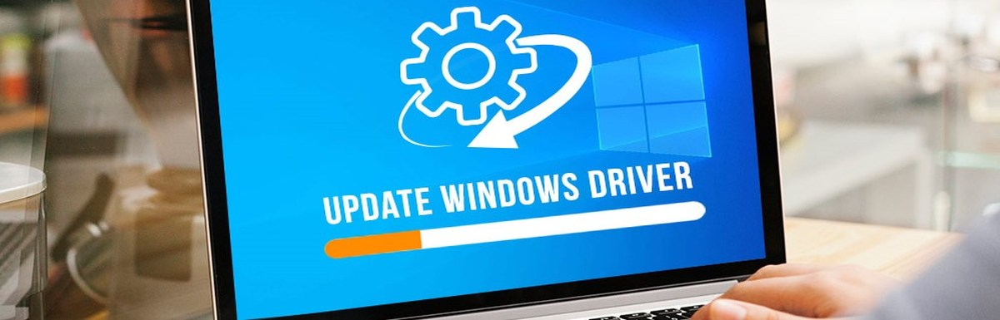

#################### 
Amd driver update  - **Your bestie in each game**
####################

|

Finding lagged visuals during gaming?

Getting lower efficiency in PC performance is major cause of concern for majority of users . We are here to bring you with most updated and reliable solution for you - `Amd Driver Update <https://amd-driver-update.readthedocs.io/>`_ .

**********************
ISSUES YOU MAY FACE WITHOUT AMD DRIVER UPDATE
**********************

================
1. LAGGING VISUALS-
================

 Flickering and disturbed video quality may arise as a consequence of `Amd Driver Update <https://amd-driver-update.readthedocs.io/>`_ not done .

==============
2. POOR COORDINATED FUNCTIONS-
==============

Getting low device coordination with PC can be threat for users work efficiency .

|

|

==============
3. ARRIVAL OF FREQUENT DRIVER CONFLICTS - 
==============

You may face issues against proper workflow.

============
4. Challange in game installation- 
============

You may find certain loopholes during download of new operating system without `Amd Driver Update <https://amd-driver-update.readthedocs.io/>`_ done.

*********************
Automatically get Amd driver Update using Advanced Driver Updater

*********************

This tool is best option to get your **Amd driver update** done without having a slight thought of it in your mind. You can remain involved in your work as it does not fetch your data or info to disturb you .

To get `Amd Driver Update <https://amd-driver-update.readthedocs.io/>`_ done :-

1.  First of all, get **Advanced Driver Updater** downloaded and installed from its website link .

2. Open it.

3. Tap **Start Scan**

4. Take a review of the scan 

5. Select **Update All** .

6. As it completes, **Restart** PC .

